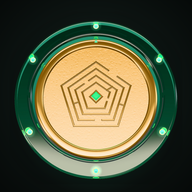

<p align="center"></p>

# Arisan

**Savings circles on Solana, for Android and Seeker.** Everyone in the circle pays into a pot each round, one member takes the whole pot, and every seat wins exactly once. A Solana program holds the money and picks each winner, not a person.

An *arisan* is the rotating savings circle that friends, families and coworkers across Indonesia already run with cash and a notebook (elsewhere it's a ROSCA, a tanda or a susu). Arisan moves the pot, the payments and the draw on chain.

| | |
|---|---|
| Try it (devnet) | https://arisan-self.vercel.app |
| Android APK | https://arisan-self.vercel.app/arisan-clockin.apk |
| Program (devnet) | [`Aw54KXqUyccCACmmry5MmCmTzqJqKfmnL868aMpJaGbB`](https://explorer.solana.com/address/Aw54KXqUyccCACmmry5MmCmTzqJqKfmnL868aMpJaGbB?cluster=devnet) |
| Demo video | [`docs/demo-video/arisan-demo.mp4`](docs/demo-video/arisan-demo.mp4) |

Tested at 20 seats. Live circle run with 2 wallets.

## Proof

### A live circle on devnet

On 5 October 2026 two wallets ran a whole two-seat circle against the deployed program with [`scripts/devnet-two-seat.cjs`](scripts/devnet-two-seat.cjs): 0.01 SOL a round, a 1× stake, 16 transactions from create to both stakes back. Circle account: [`97Bjkf1N…JD6Y`](https://explorer.solana.com/address/97Bjkf1NvggcYSiBb73pJnhXwU946285rDoWJh69JD6Y?cluster=devnet).

| Step | Signed by | Transaction |
|---|---|---|
| Create the circle | host | [`4jUB2SF9…`](https://explorer.solana.com/tx/4jUB2SF9Zk2zUhWuTBYJkkycaT4tDs6QxS8o15fyPLGeNV4q73ppUjoNNxEAEiHWupNUWrKcaeJVc4HQtP5K4h2G?cluster=devnet) |
| Take a seat | host | [`2zCQ8WYu…`](https://explorer.solana.com/tx/2zCQ8WYuYED1NMdLSM338Fvgh3HP95oHLxFTq6EbjfBHxUXRpbk5mVbimsUnu9dLYSqvr3UdUfTK4i4nR9g1KhKf?cluster=devnet) |
| Join with the invite code | second wallet | [`3wYXRA3v…`](https://explorer.solana.com/tx/3wYXRA3vNFRryFFxHfmWfA7npvkPwa6cJftdksUoVzdxyD2pGkHVXhRVV66yTCWxpqy4agorxtEG2BTepZKDv77E?cluster=devnet) |
| Stake | host | [`2wNbHKa1…`](https://explorer.solana.com/tx/2wNbHKa1EQdL8nQZHBnNZEGhjUMjSdndnw2e5f8Lyi2rp8DZB6MPEPecWbFwH9Ww5Z4Cr2jpEJ81Nab7wXbcKYXS?cluster=devnet) |
| Stake | second wallet | [`3bUuT1QW…`](https://explorer.solana.com/tx/3bUuT1QWpobCTkpaQYX28MWR9G7bUsgkGVhKMvde9birSu3quaRcxKt24ABLQB52LTTMn8F7gn49jAQXbUetPCur?cluster=devnet) |
| Start (every seat taken and staked) | host | [`25ZCDss7…`](https://explorer.solana.com/tx/25ZCDss79mftzgqisCWCbfSPFEuFpCPJmFXZTCwEUT3y2eJ2ABZYYjdgQRdS9xuR3pPPmeJK1djSJd1CDLbfS6vE?cluster=devnet) |
| Round 1: pay | host | [`EzjRPxPY…`](https://explorer.solana.com/tx/EzjRPxPYgaK7qyV8C3jcw3GtCuwxqb3NhoQAQd9sMgwVpKguugTe5j13dPEeAX3ehJJCNTZEpQiq6ggyfUtpy6U?cluster=devnet) |
| Round 1: pay | second wallet | [`4ZQk16Ae…`](https://explorer.solana.com/tx/4ZQk16Ae5U2wQe6bdvxGYKvS69wQUSS4fmKP5FnZiTodQKTyoJGmJpXSkSHyHpmk9w3wDTwSFijL49p1hgUpm188?cluster=devnet) |
| Round 1: commit the draw | host | [`2riCZnSu…`](https://explorer.solana.com/tx/2riCZnSuyipoNTyUUkmeHX5NGdnfNuJrYir12fCB3Tpr2CUPFtbN553MX1PiYQZkPTM9cvdezCtpx1ZHgeAQXS5R?cluster=devnet) |
| Round 1: draw; the vault pays the host 0.02 SOL | host | [`3soyuXGo…`](https://explorer.solana.com/tx/3soyuXGoAqzBzSBF8R8qT6nS5RifxDH6Uw9wrMMUzPdFM5gVRBNpsQ7SeHGdY4Q4DeTuzZsKrA8mC1BdUDjKc147?cluster=devnet) |
| Round 2: pay | host | [`5fK9FULq…`](https://explorer.solana.com/tx/5fK9FULqeVjtKPbPGuaPWVXfjC8EqTRp3nafBt2JMxwBywpJo7ho8Pu6NirwbmSzrCbC7A2tWrTSTZJvfsXdwqwQ?cluster=devnet) |
| Round 2: pay | second wallet | [`5SRzAjfU…`](https://explorer.solana.com/tx/5SRzAjfUP6jXyqnd2QBV8GVjCT43Hq4p2BQAFZnSKytA976wyUMuNyKxbZpT6M1SiMnSQDtnwPgdkuiWgLv3o4E1?cluster=devnet) |
| Round 2: commit the draw | host | [`KqN4DUgj…`](https://explorer.solana.com/tx/KqN4DUgjJ6vBj9u6saCVJG26aW2nDEtYQfmVb6yGgx9dxYwZa9rynKzfpyXA3L38wywpLzi5AkJUtERLT2cUAy5?cluster=devnet) |
| Round 2: draw; the vault pays the second wallet 0.02 SOL | host | [`ukSuqN5F…`](https://explorer.solana.com/tx/ukSuqN5F6RDRKxPwd5xwTSQ7Zh9pCDGmcYLqcnv5wohNKfLYDGQhYRMjrf8FeapUgH1tr42dQqkGJR9kZnveo4g?cluster=devnet) |
| Stake back | host | [`WNhq9b1r…`](https://explorer.solana.com/tx/WNhq9b1rJEMXHjpoLZoaJTshnz9p2Wg2ypQYx9v7Ujz3KuFDZwta8F2CTuwRvtUNEJuxdH6xEJ2QWzKgMgSZRdP?cluster=devnet) |
| Stake back | second wallet | [`5HD3VMtP…`](https://explorer.solana.com/tx/5HD3VMtPiTg4xoGLG42is1UQmEYq6fk5Z6PtzTx854kGxZa435WhchjZN2L67kLrrcnzmM9uKZFan9D29tmjC8Bs?cluster=devnet) |

### Tests

| What | Where | Result |
|---|---|---|
| The program, through its real entrypoint: hashed invite codes; start only when every seat is taken and staked; no draw until everyone has paid; the caller can't pick the winner; only unpaid members can be marked, and only after the deadline; a member who missed can't win until they recover; removed seats don't hold up the draw; no leaving or stake refunds once a circle starts; whole 5-, 10- and 20-seat circles (every round paid, a different winner each round, every stake back) | [`security_p0.rs`](arisan_contracts/programs/arisan_contracts/tests/security_p0.rs) | 17 passed, 1 ignored (P-2, below): [log](docs/bezel/security_p0.log) |
| The app's UI on a real chain with two wallets that really sign: a whole two-seat circle | [`e2e/chain.spec.ts`](e2e/chain.spec.ts) | passed: [log](docs/bezel/chain-ui.log) |
| The app's UI on a real chain with **twenty** signing wallets: a twenty-seat circle from create to every stake back, then checked on chain (twenty different winners, each paid the whole pot, the vault empty) | [`e2e/chain-twenty.spec.ts`](e2e/chain-twenty.spec.ts) | passed in 46 minutes: [log](docs/bezel/chain-twenty.log), [screens](docs/e2e-proof/chain-twenty) |
| The UI, API, walkthrough and wallet sheet at phone size (390 px) | [`e2e/`](e2e) | 110 passed, 8 skipped (the opt-in chain runs above and the screenshot specs): [log](docs/bezel/e2e.log), [more](docs/e2e-proof/README.md) |
| The APK on Android with a real Mobile Wallet Adapter wallet: launch, connect, create, sign, join | [`docs/APK.md`](docs/APK.md) | [docs/apk-proof](docs/apk-proof/README.md) |

The chain runs use a local `solana-test-validator` loaded with this repo's program at the devnet address, because a twenty-wallet run needs more SOL than the devnet faucet hands out. The recipe is in [`docs/bezel/devnet.md`](docs/bezel/devnet.md).

## How it works

1. **Create.** The host picks 2 to 20 seats, the amount each round, and a stake of 1×, 2× or 3× that amount. The program keeps only a SHA-256 hash of the 8-character invite code.
2. **Join and stake.** Members join with the code and deposit their stake into the circle's vault, an account owned by the program. The circle can start only when every seat is taken and staked.
3. **Pay.** Each round, every member pays the round's amount into the vault with one tap from Home. A payment record per member per round blocks double payments.
4. **Draw.** Once everyone has paid, the host can run the draw, and after the round's deadline anyone can. It takes two transactions. The commit names a slot that hasn't happened yet, so nobody knows its hash. The draw then reads that slot's hash from the `SlotHashes` sysvar and picks the winner from the members who haven't won yet, sorted by address, so the caller can't steer it. The vault pays the whole pot to the winner in the same instruction.
5. **Finish.** Every seat wins exactly once. After the last round the circle completes and every stake comes back.

A member who misses a payment can be marked after the deadline. Their stake is slashed and they have 48 hours to restake and pay; until then they can't win. After that they can be removed. A removed member doesn't hold up the draw, and can rejoin by paying what they owe.

**Big circles.** Each seat adds two accounts to the draw (its member and its payment), so from 13 seats the final draw transaction is over Solana's 1,232-byte limit. The app finishes big draws through an address lookup table, created in the same wallet approval ([`draw-table.ts`](src/lib/solana/draw-table.ts)). The twenty-wallet run found this; program tests can't, because their test bank doesn't enforce the size limit.

**On the phone.** The Android app is this Next.js app inside a Solana Mobile web shell ([`android/`](android), built by [`scripts/build-apk.sh`](scripts/build-apk.sh)), not a Trusted Web Activity, so Mobile Wallet Adapter works. It connects to Seed Vault on Seeker, Phantom, Solflare or any MWA wallet, and to Seeker Connect on the web. Keys stay in the wallet; there is no custodial signing.

## Repo map

| Path | What |
|---|---|
| [`arisan_contracts/`](arisan_contracts) | The Anchor 0.30 program (Rust) and its tests |
| [`src/`](src) | The Next.js 16 app (React 19), mobile first |
| [`src/lib/solana/`](src/lib/solana) | Instruction builders, the bound draw, the lookup table for big draws |
| [`e2e/`](e2e) | Playwright: UI, API, and real-chain runs with signing wallets |
| [`android/`](android), [`scripts/build-apk.sh`](scripts/build-apk.sh) | The Android web shell and its signed build |
| [`docs/`](docs) | Proof: logs, screenshots, runbooks |

## Run it

```bash
npm install
npm run dev        # http://localhost:3000, on devnet
```

The program's tests, in Anchor's build image:

```bash
docker run --rm -v "$PWD/arisan_contracts:/src:ro" backpackapp/build:v0.30.1 bash -lc '
  export RUSTUP_HOME=/tmp/rustup && rustup toolchain install stable --profile minimal
  cp -r /src /work && cd /work
  RUST_LOG=off cargo +stable test -p arisan_contracts --test security_p0 -- --test-threads=1'
```

To run the app against a local validator, including the two- and twenty-wallet runs, see [`docs/bezel/devnet.md`](docs/bezel/devnet.md). To build the APK, see [`docs/APK.md`](docs/APK.md).

## Status

- Devnet, SOL circles. Rounds last 1 minute in this build, so a whole circle fits in a demo. A real circle would run monthly.
- The draw runs when someone taps it: commit, then draw. It doesn't fire by itself at the deadline.
- Known issue P-2: the invite code can be worked out from the circle's public state, so it keeps strangers from stumbling in but isn't access control. The ignored test `outsider_cannot_derive_invite_code_from_pool_account` tracks it.
- Next: the Solana dApp Store listing.
